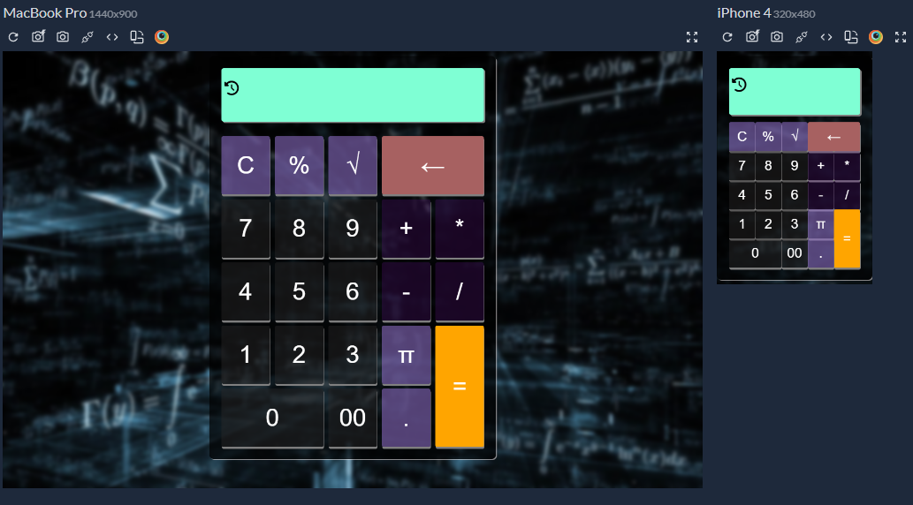

# P3-CalculadoraFinanciera
Proyecto 3 Individual del Bootcamp FemCoders 😍

- 🚀 **Desplegada en Vercel** : [Calculadora Financiera](https://p3-calculadora-financiera.vercel.app/)
---

# 📑 Índice

1. [Descripción](#-descripción)

2. [Captura de pantalla](#-screenshoot)

3. [Tecnologías Utilizadas](#-tecnologías-utilizadas)

4. [Guía de Instalación](#-guía-de-instalación)

5. [Autor](#-autora)


## 📄 Descripción

**Objetivo Profesional** 

- Desarrollar una aplicación web estática e interactiva haciendo uso de HTML, CSS y Javascript.


**Características Principales**

- **Operaciones Básicas:**
  Realiza fácilmente las operaciones fundamentales de suma, resta, multiplicación y división.

- **Funciones Avanzadas:**
  Además de las operaciones básicas, la calculadora incluye funciones avanzadas como raíz cuadrada y cálculo de porcentaje.

- **Historial de Últimos Cálculos:**
  Mantén un registro de tus operaciones más recientes con el historial de cálculos. Esto te permite revisar y recordar los pasos de tus cálculos anteriores.

- **Borrado Preciso:**
  Personaliza tu entrada con funciones de borrado. Puedes eliminar un solo dígito o borrar toda la pantalla para comenzar de nuevo.

- **Responsive y Adaptive:**
  La calculadora se adapta de manera óptima para garantizar su funcionamiento en dispositivos móviles, tablets y computadoras de escritorio.

## 🖼 Screenshoot

*Vista previa de la interfaz de la calculadora en dispositivos móviles y Ordenador.*

## 💻 Tecnologías Utilizadas

<p align="center">
  <a href="https://skillicons.dev">
    
  </a>


## 📚 Guía de Instalación

1. Clona este repositorio en tu ordenador:

   ```bash
   git clone https://github.com/DevDesiree/P3-CalculadoraFinanciera.git
    ```
    - O descárgatelo, desde el botón Code -> Download ZIP.

2. Abre el archivo index.html en tu navegador web.

3. ¡Listo! Puedes comenzar a explorar el proyecto.

## 👩‍💻 Autora
*Desiree Sánchez*

